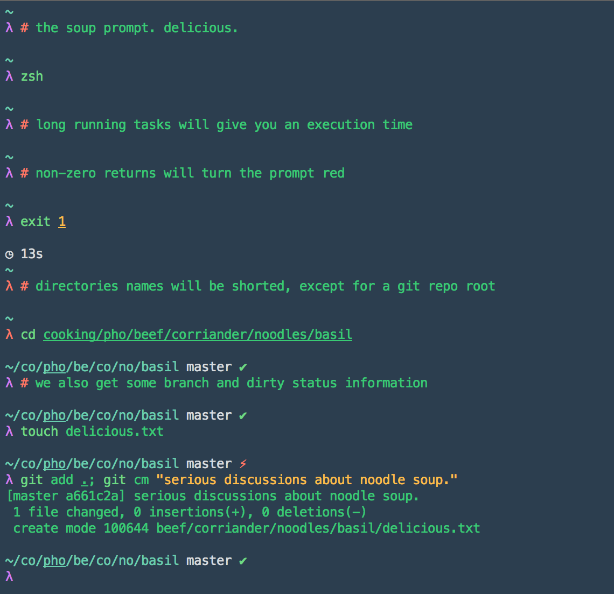

# zsh-soup-prompt

A prompt for ZSH.

This prompt is `zgen` compatible, and so its probably also `antigen` compatible.

`zgen load tomlavenziano/zsh-soup-prompt`

Credit for the original code goes to https://github.com/rktjmp, I just customized it

